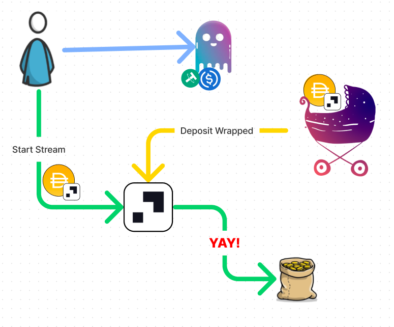

# `Stroller Protocol`

## Need for a `Stroller`

Currently users have no option other than wrapping surplus ERC20 tokens to keep the streams running. These tokens do not earn interest since Superfluid protocol is relatively new and DeFi is yet to be introduced on streams.

Stroller Protocol allows users to earn yield on ERC20 tokens without the compulsion of having to wrap them to Super Tokens. This is enabled by creating Strollers which top-up the streams with just enough Super tokens to keep the streams running without any penalties.

## Use Case

Users can invest their tokens in other DeFi protocols like `AAVE`, `Harvest`, etc. and approve the receipt tokens for our contracts. For example, Alex invests USDT in `AAVE` and gets `amUSDT` in return. She approves `amUSDT` for our contracts and creates a `stroller`. Whenever her USDTx stream will have low balance to keep the stream running for a threshold, these `amUSDT` tokens will be converted to `USDT` and transferred to Alex as `USDTx`.

Using the Top-Up service provided by Stroller Protocol, users can now be tension free about their streams running dry. Approve, create a stroller and relax. The protocol handles the headaches for you.

## How It's Made

The Stroller Protocol is built on `SuperFluid`, `ChainLink` and `Moralis`.

Users approve their invested tokens and create a stroller.
ChainLink Keepers keep checking for users' Super Token balances. If the balance can not keep the stream running for a certain threshold of time, the invested tokens are liquidated and wrapped to Super Tokens and sent to the user. This method is called Top Up.

📉 Low super-token balance => sell some investments => keep stream running 🤑

The events are indexed by moralis and displayed on the frontend. We use Moralis triggers to mutate data from the Event table to a Stroller table. We also use The Graph for querying all the stream related data.
